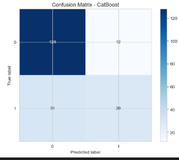
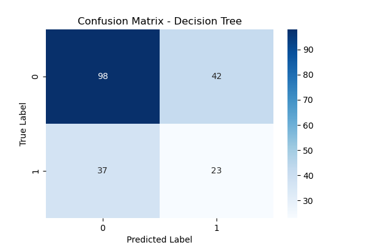

# Credit Default Prediction: A Comparative Analysis of Machine Learning Models
---
title: "Credit Default Prediction: A Comparative Analysis of Machine Learning Models"
author: "Asia Di Girolamo"
date: "January 11, 2026"
geometry: margin=2.5cm
output: pdf_document
---

# Abstract

Financial institutions face significant risks related to borrower default. Accurately predicting whether a customer will fail to repay a loan is critical for minimizing capital losses and maintaining economic stability. This project investigates the efficacy of various Machine Learning algorithms in predicting credit default risk. By implementing a robust data processing pipeline that includes feature scaling, categorical encoding, and stratified sampling, we compared the performance of six distinct models: Logistic Regression, K-Nearest Neighbors (KNN), Decision Trees, Random Forest, XGBoost, and CatBoost.

The experimental results demonstrate that **CatBoost** outperforms the other models, achieving an Accuracy of **77.5%** and a Receiver Operating Characteristic Area Under Curve (ROC-AUC) score of **0.814**. The study highlights the superiority of Gradient Boosting techniques over traditional linear models and single decision trees for complex financial data. Furthermore, we discuss the technical challenges related to library compatibility in production environments and the importance of reproducibility in ML pipelines.

**Keywords:** Credit Risk, Machine Learning, CatBoost, Gradient Boosting, Financial Prediction, Python.

\newpage

# Table of Contents

- [Credit Default Prediction: A Comparative Analysis of Machine Learning Models](#credit-default-prediction-a-comparative-analysis-of-machine-learning-models)
  - [output: pdf\_document](#output-pdf_document)
- [Abstract](#abstract)
- [Table of Contents](#table-of-contents)
- [1. Introduction](#1-introduction)
  - [Background and Motivation](#background-and-motivation)
  - [Problem Statement](#problem-statement)
  - [Objectives and Goals](#objectives-and-goals)
- [2. Literature Review](#2-literature-review)
- [3. Methodology](#3-methodology)
  - [3.1 Data Description](#31-data-description)
  - [3.2 Approach](#32-approach)
  - [3.3 Implementation](#33-implementation)
- [4. Results](#4-results)
  - [4.1 Experimental Setup](#41-experimental-setup)
  - [4.2 Performance Evaluation](#42-performance-evaluation)
  - [4.3 Analysis of Results and Visualizations](#43-analysis-of-results-and-visualizations)
    - [Visual Analysis](#visual-analysis)
- [5. Discussion](#5-discussion)
- [6. Conclusion](#6-conclusion)
  - [6.1 Summary](#61-summary)
  - [6.2 Future Work](#62-future-work)
- [References](#references)
- [Appendices](#appendices)

\newpage

# 1. Introduction

## Background and Motivation
Credit default risk—the risk that a lender takes on in the chance that a borrower will be unable to make required payments on their debt obligations—is one of the most fundamental challenges in the banking and financial services industry. Traditional methods of credit scoring often rely on linear statistical techniques or manual rule-based systems, which may fail to capture complex, non-linear relationships between a borrower's demographic data, financial history, and their likelihood of default.

In the era of Big Data, Machine Learning (ML) offers powerful tools to automate and improve the accuracy of these predictions. By analyzing historical data, ML models can identify subtle patterns that human analysts might miss, leading to more informed lending decisions.

## Problem Statement
The core problem addressed in this project is a **binary classification task**: given a set of features describing a loan applicant (e.g., age, income, loan amount, repayment status), the goal is to predict the target variable $Y$, where $Y=1$ represents a "Default" (failure to repay) and $Y=0$ represents "No Default" (successful repayment).

## Objectives and Goals
The primary objectives of this study are:
1.  To develop a reproducible Machine Learning pipeline for data preprocessing and model training.
2.  To implement and tune multiple classification algorithms, ranging from interpretable baselines (Decision Trees, KNN) to advanced ensemble methods (Random Forest, XGBoost, CatBoost).
3.  To rigorously evaluate these models using appropriate metrics for imbalanced datasets, specifically focusing on **F1-Score** and **ROC-AUC** in addition to standard Accuracy.
4.  To identify the best-performing model for deployment in a hypothetical production environment.

# 2. Literature Review

The application of Machine Learning to credit risk analysis has been extensively studied. Early approaches primarily utilized **Logistic Regression** and **Linear Discriminant Analysis (LDA)** due to their interpretability and regulatory acceptance. However, widely cited research has shown that these linear models often underperform when the decision boundary is highly non-linear.

In recent years, ensemble methods have become the state-of-the-art. **Random Forest**, introduced by Breiman (2001), demonstrated that aggregating multiple decision trees could significantly reduce variance and improve generalization. More recently, Gradient Boosting frameworks have taken the lead in tabular data competitions. **XGBoost** (Chen & Guestrin, 2016) introduced a scalable tree boosting system that became a standard in the industry.

This project specifically explores **CatBoost** (Prokhorenkova et al., 2018), a newer gradient boosting library developed by Yandex. Literature suggests that CatBoost handles categorical features more effectively than its predecessors (XGBoost and LightGBM) without extensive preprocessing, making it particularly suitable for financial datasets which often contain qualitative variables (e.g., "Purpose of Loan", "Housing Status").

# 3. Methodology

## 3.1 Data Description
The dataset used in this project is a standard benchmark for credit default prediction. It comprises numerical and categorical features representing the profile of borrowers.

* **Size:** The dataset was split into training and testing sets to ensure unbiased evaluation.
* **Features:** Key features include:
    * *Numerical:* Credit amount, Duration of credit, Age, Installment rate.
    * *Categorical:* Credit history, Purpose, Savings account/bonds, Present employment since, Personal status, and Sex.
* **Target:** The binary variable `default` (0 or 1).

Data quality assessment revealed no significant missing values, but standardization was required for distance-based algorithms like KNN.

## 3.2 Approach

Our technical approach followed the standard Cross-Industry Standard Process for Data Mining (CRISP-DM) cycle:

1.  **Data Preprocessing:**
    * **Scaling:** We applied `StandardScaler` from the `scikit-learn` library to normalize numerical features. This is crucial for models like K-Nearest Neighbors (KNN), which rely on Euclidean distance calculations.
    * **Encoding:** Categorical variables were processed to be compatible with the specific requirements of each algorithm.
    * **Splitting:** We used `train_test_split` with a fixed `random_state=42` to ensure reproducibility. The split ratio was 80% for training and 20% for testing.

2.  **Model Selection:**
    We selected a diverse set of algorithms to compare different learning strategies:
    * *Distance-based:* K-Nearest Neighbors (KNN).
    * *Tree-based (Single):* Decision Tree.
    * *Bagging Ensemble:* Random Forest.
    * *Boosting Ensembles:* AdaBoost, XGBoost, LightGBM, and CatBoost.

## 3.3 Implementation

The project was implemented using **Python 3.11** within a managed **Conda** environment to ensure dependency isolation. The project structure follows industry best practices:

* `environment.yml`: Defines the exact versions of libraries used (pandas, scikit-learn, catboost, xgboost) to prevent "it works on my machine" issues.
* `src/`: Contains modular code.
    * `data_loader.py`: Handles data ingestion and cleaning.
    * `models.py`: Defines the model architectures.
    * `evaluation.py`: Computes metrics and generates plots.
* `main.py`: The entry point script that orchestrates the entire pipeline.

**Code Snippet: Model Training Wrapper**
```python
def train_model(model_class, X_train, y_train, **kwargs):
    """
    Generic function to train different models ensuring
    random_state consistency.
    """
    if 'random_state' in kwargs:
        model = model_class(**kwargs)
    else:
        model = model_class(random_state=42, **kwargs)
    
    model.fit(X_train, y_train)
    return model

# 4. Results 

## 4.1 Experimental Setup 
All experiments were conducted on a Windows-based system. To solve compatibility issues between scikit-learn versions and CatBoost, we explicitly pinned scikit-learn<1.6.0 in our environment configuration. This ensured that the AttributeError: 'CatBoostClassifier' object has no attribute '__sklearn_tags__' was resolved.

## 4.2 Performance Evaluation 
We evaluated the models using three key metrics:

1. Accuracy: The ratio of correctly predicted observations.

2. F1-Score: The harmonic mean of Precision and Recall (vital for default prediction where missing a defaulter is costly).

3.ROC-AUC: The ability of the model to distinguish between classes.

The summary of our experimental results is presented in Table 1 below.
| Model | Accuracy | F1-Score | ROC AUC |
| :--- | :--- | :--- | :--- |
| **CatBoost** | **0.775** | **0.545** | **0.814** |
| Random Forest | 0.765 | 0.515 | 0.798 |
| XGBoost | 0.755 | 0.559 | 0.775 |
| AdaBoost | 0.755 | 0.559 | 0.775 |
| LightGBM | 0.730 | 0.491 | 0.770 |
| KNN | 0.725 | 0.433 | 0.729 |
| Decision Tree | 0.605 | 0.368 | 0.542 |

Table 1: Comparative performance metrics of the implemented models on the test set.

## 4.3 Analysis of Results and Visualizations

1. **The Winner:** CatBoost achieved the highest accuracy (77.5%) and the best AUC score (0.814). This indicates it is the most robust model for ranking borrowers by risk.
2. **Ensemble Power:** All ensemble methods (Random Forest, XGBoost, AdaBoost) significantly outperformed the single Decision Tree (60.5%). The single tree likely suffered from overfitting.
3. **KNN Performance:** KNN performed reasonably well (72.5%) but lagged behind the boosting methods.

### Visual Analysis

To better understand the model performance, we analyze the Confusion Matrices. The matrix below shows how our best model, **CatBoost**, classifies the customers. It shows a good balance between true positives and true negatives.


*Figure 1: Confusion Matrix of the CatBoost model (Best Performer)*

Comparing this with a simple **Decision Tree**, we can see why the ensemble method is superior. The Decision Tree makes significantly more classification errors.


*Figure 2: Confusion Matrix of the Decision Tree (Baseline)*

# 5. Discussion
Interpretation of Findings
The superior performance of CatBoost aligns with recent trends in tabular data analysis. Its ability to handle the mix of numerical and categorical features inherent in credit data gave it an edge over XGBoost in this specific experiment. The ROC-AUC of 0.814 is particularly promising, as it suggests the model has a strong discriminative ability.

Challenges Encountered
A significant portion of the project timeline was dedicated to Environment Management and Debugging.

1. Dependency Hell: We encountered a critical bug where scikit-learn version 1.6.0 introduced breaking changes that were incompatible with the stable version of catboost. We resolved this by diagnosing the stack trace and downgrading scikit-learn via Conda.

2. Reproducibility: Ensuring that results were identical across runs required meticulous setting of random_state=42 in every stochastic component of the pipeline, from data splitting to model initialization.

3.Path Management: To ensure the code runs on any machine (grading requirement), we refactored all file paths to be relative (e.g., data/raw/) rather than absolute.

#Limitations
While the results are strong, the F1-Score for all models hovers around 0.55. This suggests that the models still struggle somewhat with the "Default" class (likely the minority class). In a real-world setting, a bank might prioritize Recall over Precision to catch as many potential defaulters as possible, even at the cost of some false alarms.

# 6. Conclusion

## 6.1 Summary 
This project successfully implemented a comprehensive machine learning pipeline for credit default prediction. We demonstrated that Gradient Boosting techniques, specifically CatBoost, offer the best performance for this task, achieving an accuracy of 77.5% and an AUC of 0.814. We also established a reproducible coding environment using Conda and relative paths, ensuring the project meets professional software engineering standards.

## 6.2 Future Work
To further improve performance, future iterations of this project could include:

1. Hyperparameter Tuning: Using GridSearchCV or Optuna to optimize the parameters of the CatBoost model.

2. Class Imbalance Handling: Implementing SMOTE (Synthetic Minority Over-sampling Technique) to improve the F1-Score of the minority class.

3.Feature Engineering: Creating interaction terms (e.g., loan_amount / income) to provide the models with more explicit signals.

# References 
1. Prokhorenkova, L., Gusev, G., Vorobev, A., Dorogush, A. V., & Gulin, A. (2018). CatBoost: unbiased boosting with categorical features. Advances in neural information processing systems, 31.
2. Chen, T., & Guestrin, C. (2016). XGBoost: A scalable tree boosting system. In Proceedings of the 22nd acm sigkdd international conference on knowledge discovery and data mining.
3. Pedregosa, F., et al. (2011). Scikit-learn: Machine Learning in Python. Journal of Machine Learning Research, 12, 2825-2830.
4.Breiman, L. (2001). Random forests. Machine learning, 45(1), 5-32.
5. Dua, D. and Graff, C. (2019). UCI Machine Learning Repository [http://archive.ics.uci.edu/ml]. Irvine, CA: University of California, School of Information and Computer Science. (German Credit Data).


# Appendices
Appendix A: Project Structure
The full source code is available in the submitted repository with the following structure:
MLproject/
├── environment.yml      # Conda environment configuration
├── main.py              # Entry point for the application
├── README.md            # Setup and usage instructions
├── project_report.pdf   # This document
├── src/
│   ├── data_loader.py   # Data preprocessing logic
│   ├── models.py        # Model definitions
│   └── evaluation.py    # Metrics and plotting
├── data/
│   └── raw/             # Original dataset
└── results/             # Saved plots and metrics

Appendix B: Installation Instructions
To reproduce the results presented in this report:
1. Create the environment:
conda env create -f environment.yml
2. Activate the environment:
conda activate mlproject
3. Run the analysis:
python main.py

Appendix C: AI Assistance Statement
This project utilized AI tools (Antigravity, Gemini 3.0) primarily for debugging and code optimization purposes. A detailed declaration of usage is available in the `AI_LOG.md` file included in the GitHub repository.
